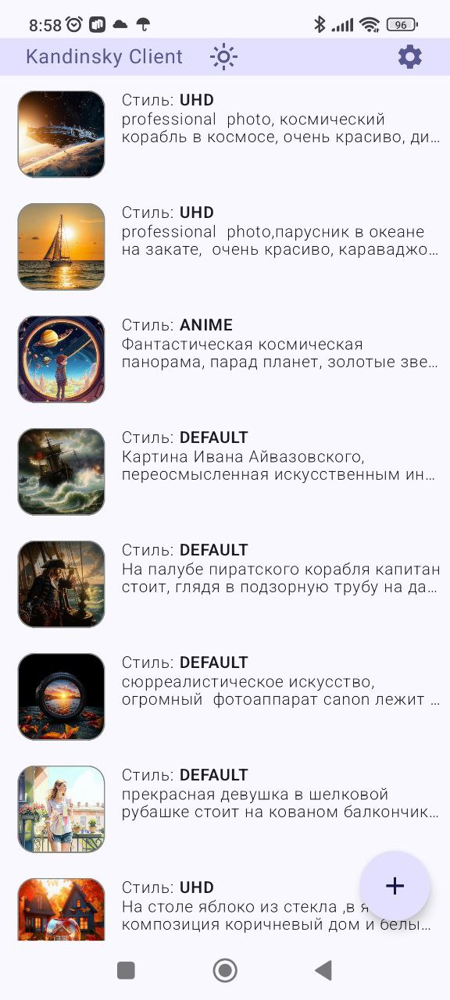
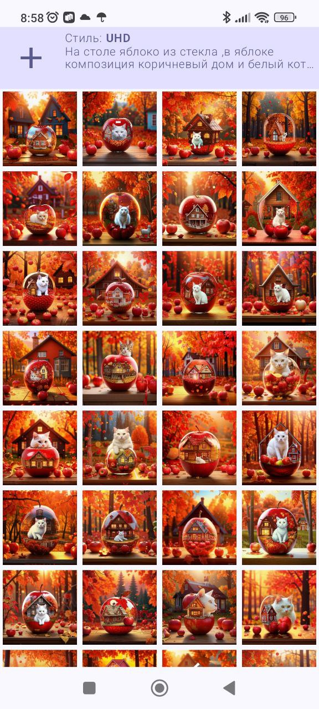
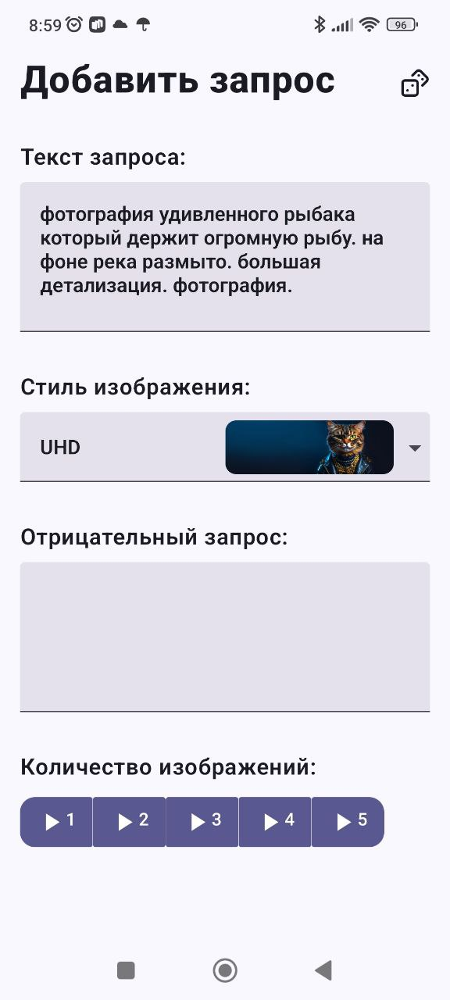

# Мобильное приложение для генерации изображений на платформе Fusion Brain, генеративная модель Kandinsky

## Использованы библиотеки

- [Jetpack Compose](https://developer.android.com/compose)
- [Hilt](https://dagger.dev/hilt/)
- [Room](https://developer.android.com/training/data-storage/room)
- [Retrofit](https://square.github.io/retrofit/)
- [Coil](https://coil-kt.github.io/coil/)
- [Work Manager](https://developer.android.com/jetpack/androidx/releases/work)

## Превью

 

## Контакты

* CyberTown: https://cybertown.pro/
